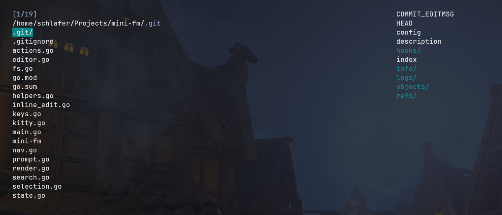

# mini-fm

A minimal, keyboard-driven TUI file manager written in Go. Fuzzy filter,
inline rename/copy, multi-select with bash, live previews (text + images),
and shell integration — no config file required.



## Features

- **Fuzzy search** — type to filter; case-insensitive substring *or* fuzzy match, sorted exact → prefix → shortest
- **Inline rename & copy** — edit the name in place (Ctrl-R / Ctrl-Y); copy destinations can be nested paths and parent dirs are created for you
- **Multi-select + bash** — mark files, then run any command on them with a `%` placeholder that expands to a `{a,b,c}` brace list
- **Live preview pane** — syntax-highlighted text (chroma), directory contents, and images via the [kitty graphics protocol](https://sw.kovidgoyal.net/kitty/graphics-protocol/)
- **Shell integration** — quits by printing `cd …` or `$EDITOR …` for your shell to run, so the shell's cwd and history stay in sync
- **Zero config** — one binary, one optional flag

## Install

Build from source:

```sh
git clone https://github.com/schlafer/mini-fm && cd mini-fm
go build -o mini-fm
```

## Usage (Experimental)

save inside your .bashrc file:

```sh
alias f='eval $(/path/to/mini-fm)'
```

Image previews are written to `/dev/tty` (stdout is reserved for shell
commands), so they render fine even when piped.

### Flags

| Flag | Description |
| --- | --- |
| `-preview`, `-p` | Show the preview pane (default: on) |

## Keys

Normal mode:

| Key | Action |
| --- | --- |
| `Down` / `Ctrl-J` / `Ctrl-N` | Move cursor down |
| `Up` / `Ctrl-K` / `Ctrl-P` | Move cursor up |
| `Left` / `Ctrl-H` / `Ctrl-B` | Go up one directory |
| `Tab` / `Right` / `Ctrl-F` / `Ctrl-L` | Enter a directory, or pick a file (quits, opens it in `$EDITOR`) |
| `Enter` | Quit and `cd` into the current directory (selected entry if a filter is active) |
| `Backspace` / `Delete` | Remove last filter char — or go up a directory if the filter is empty |
| `Ctrl-W` | Remove last filter *word* |
| `~` | Jump back to the previous directory (when not filtering) |
| `Ctrl-E` | Toggle between `$HOME` and `/` |
| `Ctrl-S` | Copy selected path to the clipboard |
| `Ctrl-O` | Open with the OS default app (runs it directly if executable) |
| `Ctrl-R` | Inline rename (Enter to commit, Esc to cancel) |
| `Ctrl-Y` | Inline copy — type the destination, `sub/dir/file` creates `sub/dir` |
| `Ctrl-A` | Create file or dir — trailing `/` makes a dir, parents are created |
| `Ctrl-D` | Delete (asks `y/n`) |
| `Ctrl-X` | Multi-select (see below) |
| `Esc` / `Ctrl-C` | Leave select mode, or quit |

Any other key types into the fuzzy filter.

Inline editors (rename/copy) and prompts:

| Key | Action |
| --- | --- |
| `Enter` | Commit |
| `Esc` / `Ctrl-C` | Cancel |
| `Left` / `Right` | Move cursor |
| `Ctrl-A` / `Ctrl-E` | Beginning / end of line |
| `Ctrl-K` / `Ctrl-U` | Kill to end / kill all |
| `Ctrl-W` | Kill word before cursor |

### Multi-select

1. `Ctrl-X` — enter select mode and mark the current entry (cursor moves on)
2. `Tab` on entries to toggle them marked (`*` in the gutter, count in the status line)
3. `Ctrl-X` again — a bash prompt opens, prefilled with `%`
4. Type a command; `%` is replaced with the marked set as a brace list
   (a single file is inserted bare), e.g.

```
bash (%=sel): mv % /tmp/stash/
# runs: mv {a.txt,b.txt,c.txt} /tmp/stash/
```

The command runs via `bash -c` in the current directory.

## Previews

- **Text** — syntax-highlighted (chroma, *modus-vivendi*), files up to 50 kB
- **Directories** — listing of their contents
- **Images** — rendered through the kitty graphics protocol, aspect-fit to the
  pane and cached per size. Works in **kitty**, **Ghostty**, and **WezTerm**;
  under **tmux** enable passthrough:

  ```tmux
  set -g allow-passthrough on
  ```

  (Images over 10 MB are skipped; small PNGs are passed through untouched.)

## Project layout

| File | What it does |
| --- | --- |
| `main.go` | Event loop, flags, kitty/tty setup |
| `keys.go` | Normal-mode keybindings |
| `actions.go` | Open, delete, create, multi-select, quit/`cd` actions |
| `nav.go` | Up-dir, filter input, word backspace |
| `search.go` | Fuzzy search, sorting, cursor/scroll management |
| `fs.go` | Recursive copy, dir switching, symlink-aware dir detection |
| `render.go` | All drawing: file list, previews, inline editors |
| `kitty.go` | Kitty graphics protocol, image resize + cache, tmux wrapping |
| `editor.go` | The shared line editor (rename, copy, prompts) |
| `inline_edit.go` | Rename/copy commit logic |
| `prompt.go` | Modal prompts (delete confirm, create, bash) |
| `selection.go` | Multi-select bookkeeping |
| `state.go` | Global state and tunables |
